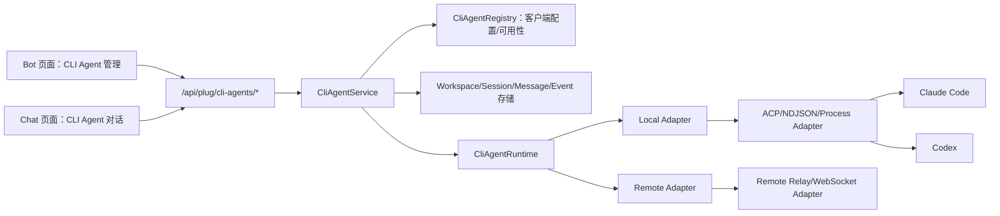
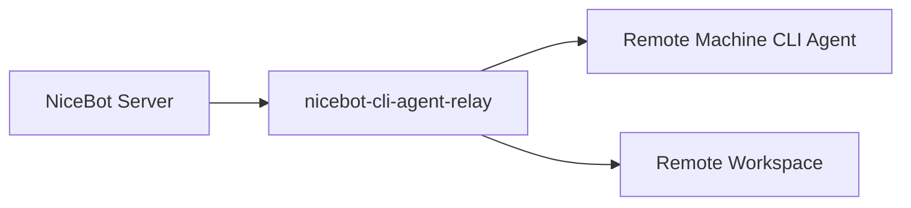

# NiceBot Chat CLI Agent 集成系统分析设计

> 日期：2026-05-05
> 状态：设计草案
> 范围：仅系统分析与方案设计，不包含代码实现。
> 参考项目：`https://github.com/iOfficeAI/AionUi`

## 1. 背景

NiceBot 当前已经形成三个主要入口：

1. `Bot`：机器人、平台、Provider、Agent 等配置入口。
2. `Chat`：NiceBot 默认聊天入口，已有会话、项目、线程、流式消息、工具调用、推理展示，以及 Work 任务侧栏。
3. `Work`：任务工作台，基于 Agent System 和 LangGraph TaskCenter 执行任务。

本次设想是在 `Chat` 页面支持直接与 Claude Code、Codex 等外部 CLI Agent 对话。CLI Agent 可以运行在 NiceBot 所在机器，也可以运行在远程机器。交互上：

1. `Bot` 页面新增 `CLI Agent` 管理。
2. 可配置本地或远程客户端。
3. 启用后，在 `Chat` 左侧导航 `NiceBot` 分组下新增对应对话入口，例如 `Claude`、`Codex`。
4. 对话入口需要明确标记 `本地` / `远程`。
5. 聊天窗口右侧增加 `会话 + 工作区` 管理。
6. 主对话区按 `工作区 + 会话` 组织 CLI Agent 对话。

关键挑战是：Claude、Codex、未来的 Qwen/Goose/OpenCode 等不应该被硬编码进 Chat 页面。NiceBot 需要一个稳定的 CLI Agent 抽象层，统一本地/远程、会话恢复、工作区、流式输出、权限确认、工具调用与错误恢复。

## 2. AionUi 可借鉴点

参考 AionUi 后，最值得 NiceBot 采用的是这些思路：

1. **CLI Agent 是独立后端，不是普通模型配置。**
   AionUi 把 Gemini、Claude、Codex、ACP、自定义 Agent、远程 Agent 都作为可检测、可配置、可独立会话的 Agent 后端。

2. **Agent 检测与聊天渲染分离。**
   AionUi 有类似 `AcpDetector` 的发现层，负责检测内置 CLI、扩展 CLI、自定义 CLI、远程 Agent。UI 消费的是归一化后的 Agent 列表。

3. **ACP 是优先协议抽象。**
   AionUi 对 Claude、Codex、Qwen、Goose、OpenCode 等 coding agents 倾向通过 ACP 或 ACP-like adapter 对接，而不是直接解析终端文本。

4. **Claude Code 不一定直接执行 `claude`。**
   AionUi 的 Claude 路径会通过 ACP bridge 包与 Claude Code 通信，bridge 使用 stdin/stdout 上的 JSON-RPC/NDJSON 协议。这个细节提醒我们：NiceBot 不应该假设每个 CLI 都能用一条固定命令稳定驱动。

5. **Workspace 是会话契约的一部分。**
   Coding Agent 的会话不只是消息列表，还包括工作目录、文件权限、环境变量、规则、session resume key。

6. **远程 Agent 是配置实例。**
   远程连接配置独立存储，会话只引用远程 agent id 和自己的 session key。这样用户修改远程地址或 token 后，不需要迁移历史会话。

7. **权限请求是一等事件。**
   文件读写、命令执行、工具调用需要能进入 UI，让用户审批、拒绝、记忆授权。

NiceBot 需要吸收这些架构思想，但不能照搬 AionUi 的 Electron 主进程结构。NiceBot 应该基于现有 Python/Quart 后端、Vue Dashboard、WebChat 会话模型和 Work 任务模型做本地化设计。

## 3. 目标

1. 支持在 `Bot > CLI Agent` 中配置 Claude/Codex 的本地客户端和远程客户端。
2. 启用后的客户端出现在 `Chat` 左侧 `NiceBot` 分组下。
3. 支持从 `Chat` 直接创建、恢复、停止 CLI Agent 会话。
4. 支持工作区维度组织会话，一个工作区下可有多个 CLI Agent 会话。
5. 支持流式输出、推理过程、工具调用、权限请求、错误、token/usage 统计。
6. 后端对本地和远程 Agent 提供统一 facade API。
7. 不破坏现有 NiceBot 默认聊天、项目聊天、线程聊天、Work 任务入口。
8. 首批支持 Claude 与 Codex，并为未来接入 Qwen、Goose、OpenCode、Cursor Agent 留扩展点。

## 4. 非目标

1. 首版不替换现有 Provider/Model 聊天能力。
2. 首版不把所有 CLI Agent 对话都包装成 Work 任务。
3. 首版不实现多 CLI Agent 团队协作。
4. 首版不暴露原始终端。
5. 首版不做复杂远程 SSH 终端托管。
6. 首版不默认绕过权限确认。
7. 首版不把密钥明文裸存作为最终方案。如果当前项目缺少密钥加密设施，需要先补 secret storage 方案。

## 5. 总体架构

推荐新增 `CLI Agent Facade`，把 CLI Agent 作为 NiceBot 的一个独立能力域。



这个 facade 负责：

1. 客户端配置。
2. 可用性检测。
3. 工作区绑定。
4. 会话生命周期。
5. 消息和事件落库。
6. SSE 流式推送。
7. 权限请求与人工响应。

Chat 页面只消费统一 API 和统一事件，不直接关心底层是 Claude、Codex、本地进程还是远程 relay。

## 6. 产品对象模型

### 6.1 CLI Agent Client

一条 client 表示一个用户可选择的 CLI Agent 入口，例如：

1. `Claude Local`
2. `Codex Local`
3. `Claude Office PC`
4. `Codex Build Server`

字段语义：

1. 显示名称。
2. Agent 类型：`claude`、`codex`、未来 `qwen`、`goose`、`opencode`。
3. 位置类型：`local` / `remote`。
4. 传输类型：`acp_stdio`、`native_stdio`、`remote_ws`、`remote_http_sse`。
5. 是否启用。
6. 可用状态。
7. 默认工作区。
8. 权限策略。
9. 环境变量和启动参数。

### 6.2 Workspace

Workspace 是 CLI Agent 的文件系统上下文。

字段语义：

1. 工作区名称。
2. 工作区路径。
3. 本地/远程标识。
4. 关联的远程 client。
5. 规则/项目说明。
6. 环境变量。
7. 状态。

本地 workspace 的路径在 NiceBot 服务器所在机器上。远程 workspace 的路径在远程机器上，UI 必须明确显示为远程路径，避免用户误判。

### 6.3 Session

Session 是用户、CLI Agent Client、Workspace 之间的一条可恢复会话。

字段语义：

1. NiceBot 内部 session id。
2. client id。
3. workspace id。
4. CLI/远程返回的 external session key。
5. 标题。
6. 状态：空闲、运行中、等待权限、失败、归档。
7. token/usage 统计。
8. 最近活动时间。
9. 消息和结构化事件。

## 7. 数据模型设计

### 7.1 `cli_agent_clients`

```sql
CREATE TABLE cli_agent_clients (
  id TEXT PRIMARY KEY,
  name TEXT NOT NULL,
  agent_kind TEXT NOT NULL,
  location_kind TEXT NOT NULL,
  transport_kind TEXT NOT NULL,
  command TEXT DEFAULT '',
  args TEXT DEFAULT '[]',
  executable_path TEXT DEFAULT '',
  remote_url TEXT DEFAULT '',
  auth_type TEXT DEFAULT 'none',
  auth_secret TEXT DEFAULT '',
  env TEXT DEFAULT '{}',
  default_workspace_id TEXT DEFAULT NULL,
  permission_policy TEXT DEFAULT 'ask',
  enabled INTEGER DEFAULT 1,
  status TEXT DEFAULT 'unknown',
  status_message TEXT DEFAULT '',
  last_checked_at TEXT DEFAULT NULL,
  created_at TEXT NOT NULL,
  updated_at TEXT NOT NULL
);
```

### 7.2 `cli_agent_workspaces`

```sql
CREATE TABLE cli_agent_workspaces (
  id TEXT PRIMARY KEY,
  name TEXT NOT NULL,
  path TEXT NOT NULL,
  location_kind TEXT NOT NULL,
  remote_client_id TEXT DEFAULT NULL,
  rules TEXT DEFAULT '',
  env TEXT DEFAULT '{}',
  status TEXT DEFAULT 'active',
  created_at TEXT NOT NULL,
  updated_at TEXT NOT NULL
);
```

### 7.3 `cli_agent_sessions`

```sql
CREATE TABLE cli_agent_sessions (
  id TEXT PRIMARY KEY,
  client_id TEXT NOT NULL,
  workspace_id TEXT NOT NULL,
  title TEXT NOT NULL,
  external_session_key TEXT DEFAULT '',
  status TEXT DEFAULT 'idle',
  total_tokens INTEGER DEFAULT 0,
  input_tokens INTEGER DEFAULT 0,
  output_tokens INTEGER DEFAULT 0,
  last_error TEXT DEFAULT '',
  created_at TEXT NOT NULL,
  updated_at TEXT NOT NULL,
  FOREIGN KEY(client_id) REFERENCES cli_agent_clients(id),
  FOREIGN KEY(workspace_id) REFERENCES cli_agent_workspaces(id)
);
```

### 7.4 `cli_agent_messages`

```sql
CREATE TABLE cli_agent_messages (
  id TEXT PRIMARY KEY,
  session_id TEXT NOT NULL,
  role TEXT NOT NULL,
  content TEXT NOT NULL,
  external_message_id TEXT DEFAULT '',
  created_at TEXT NOT NULL,
  FOREIGN KEY(session_id) REFERENCES cli_agent_sessions(id)
);
```

`content` 使用 NiceBot Chat 已有 message parts 风格，方便复用 `ChatMessageList`。

### 7.5 `cli_agent_events`

```sql
CREATE TABLE cli_agent_events (
  id TEXT PRIMARY KEY,
  session_id TEXT NOT NULL,
  event_type TEXT NOT NULL,
  payload TEXT NOT NULL,
  created_at TEXT NOT NULL,
  FOREIGN KEY(session_id) REFERENCES cli_agent_sessions(id)
);
```

### 7.6 `cli_agent_permissions`

```sql
CREATE TABLE cli_agent_permissions (
  id TEXT PRIMARY KEY,
  session_id TEXT NOT NULL,
  client_id TEXT NOT NULL,
  request_key TEXT NOT NULL,
  title TEXT NOT NULL,
  body TEXT DEFAULT '',
  payload TEXT NOT NULL,
  status TEXT DEFAULT 'pending',
  decision TEXT DEFAULT '',
  created_at TEXT NOT NULL,
  responded_at TEXT DEFAULT NULL
);
```

## 8. 后端 API 设计

新增 facade API：

```text
GET    /api/plug/cli-agents/clients
POST   /api/plug/cli-agents/clients
PATCH  /api/plug/cli-agents/clients/:id
DELETE /api/plug/cli-agents/clients/:id
POST   /api/plug/cli-agents/clients/:id/check

GET    /api/plug/cli-agents/workspaces
POST   /api/plug/cli-agents/workspaces
PATCH  /api/plug/cli-agents/workspaces/:id
DELETE /api/plug/cli-agents/workspaces/:id

GET    /api/plug/cli-agents/sessions
POST   /api/plug/cli-agents/sessions
GET    /api/plug/cli-agents/sessions/:id
PATCH  /api/plug/cli-agents/sessions/:id
DELETE /api/plug/cli-agents/sessions/:id

POST   /api/plug/cli-agents/sessions/:id/messages
POST   /api/plug/cli-agents/sessions/:id/stop
GET    /api/plug/cli-agents/sessions/:id/events
POST   /api/plug/cli-agents/permissions/:id/respond
```

SSE 事件统一为：

```json
{ "event": "text_delta", "text": "..." }
{ "event": "reasoning", "text": "..." }
{ "event": "tool_call", "id": "...", "name": "...", "args": {} }
{ "event": "tool_result", "id": "...", "result": "..." }
{ "event": "permission", "permission_id": "...", "title": "...", "body": "..." }
{ "event": "token", "input_tokens": 0, "output_tokens": 0, "total_tokens": 0 }
{ "event": "lifecycle", "status": "running" }
{ "event": "error", "message": "..." }
```

## 9. Runtime Adapter 设计

### 9.1 统一接口

```python
class CliAgentAdapter:
    async def check(self) -> AgentCheckResult: ...
    async def start_session(self, session: CliAgentSession) -> SessionStartResult: ...
    async def send_message(self, session_id: str, parts: list[dict]) -> AsyncIterator[CliAgentEvent]: ...
    async def respond_permission(self, permission_id: str, decision: dict) -> None: ...
    async def stop(self, session_id: str) -> None: ...
```

### 9.2 本地 ACP Adapter

首选用于 Claude，以及未来支持 ACP 的 Codex 或其他 CLI。

职责：

1. 解析命令、bridge、启动参数。
2. 构建增强环境变量。
3. 以 workspace 作为 `cwd` 启动子进程。
4. 进行 initialize/session 握手。
5. 把 ACP session update 转换为 NiceBot 统一事件。
6. 把 permission request 转换为 `cli_agent_permissions`。
7. 支持 stop/cancel。

Claude 建议优先使用 ACP bridge，而不是直接解析 `claude` 的终端文本。

### 9.3 本地 Native Adapter

如果 Codex 当前环境没有稳定 ACP 路径，则用 Native Adapter 包一层，但必须仍然输出统一事件。

优先级：

1. CLI 官方 JSON event / stream mode。
2. CLI 官方 stdio protocol。
3. PTY 文本解析只作为最后兜底，不建议作为首版主路径。

### 9.4 远程 Adapter

不建议首版通过 SSH 直接拉起远程终端并解析输出。推荐新增轻量远程 relay：



远程 relay 职责：

1. 在远程机器本地启动 Claude/Codex。
2. 校验远程 workspace 路径。
3. 管理远程进程和 session key。
4. 对 NiceBot 暴露 WebSocket/SSE。
5. 执行远程权限策略。

NiceBot Dashboard 不直接连接远程 Agent，浏览器只连接 NiceBot 后端。

## 10. 前端交互设计

### 10.1 Bot 页面：CLI Agent 管理

在 `Bot` 页面新增 `CLI Agent` 管理入口。

列表字段：

1. 名称。
2. Agent 类型图标：Claude、Codex、自定义。
3. `本地` / `远程` badge。
4. 状态：可用、不可用、需要认证、错误。
5. 默认工作区。
6. 最近检查时间。

编辑字段：

1. Agent 类型。
2. 位置类型。
3. 本地命令/可执行文件。
4. 远程 URL/认证。
5. 默认工作区。
6. 环境变量。
7. 权限策略。

权限策略建议：

1. `ask`：默认，每次敏感操作询问。
2. `workspace_read`：允许读取工作区内文件。
3. `workspace_write_ask`：读允许，写/命令询问。
4. `trusted_bypass`：仅可信本地客户端允许，UI 需要强提醒。

### 10.2 Chat 左侧导航

在 `NiceBot` 分组下增加启用的 CLI Agent：

```text
NiceBot
  NiceBot 默认聊天
  Claude Local        本地
  Codex Local         本地
  Claude Office       远程
  Codex Build Server  远程
```

规则：

1. 只展示启用的 client。
2. 必须标记本地/远程。
3. 不可用 client 可以展示为禁用或 warning 状态。
4. 点击后进入 CLI Agent Chat 模式。
5. NiceBot 默认聊天逻辑保持不变。

### 10.3 Chat 主对话区

CLI Agent 模式尽量复用现有 `ChatMessageList` 和 `ChatInput`。

差异：

1. 顶部显示当前 client 和 workspace。
2. composer 发送到 CLI Agent session API。
3. SSE reader 消费 CLI Agent 统一事件。
4. 权限卡片显示在消息流里，也同步显示在右侧面板。
5. 工具调用、文件操作、推理沿用现有 Chat 消息视觉语言。

### 10.4 右侧工作区 + 会话面板

CLI Agent 模式下增加右侧 drawer/panel。

结构：

```text
工作区
  当前工作区
  切换工作区
  路径/远程路径
  规则摘要

会话
  当前工作区
    Session A
    Session B
  其他工作区
    Session C

待审批
  Permission Cards
```

这个面板与现有 Work 任务侧栏不同：

1. Work 任务侧栏管理任务。
2. CLI Agent 右侧面板管理工作区、会话、权限。

### 10.5 移动端

1. 左侧导航沿用现有 drawer。
2. 右侧工作区/会话面板变成临时 drawer。
3. 主聊天保持单列。
4. 权限请求既可在消息流处理，也可从 drawer 处理。

## 11. 权限与安全

CLI coding agent 可以读写文件、执行命令、访问环境变量，必须按高风险能力处理。

必做约束：

1. 工作区路径 allowlist。
2. UI 明确标识本地/远程。
3. 每个 client 有独立权限策略。
4. 默认权限策略为 `ask`。
5. 远程 client 默认不能继承 NiceBot 服务端环境变量。
6. 环境变量必须由用户显式配置。
7. 认证密钥需要加密或走现有 secret storage。
8. 权限请求必须落库，刷新后可恢复。
9. 运行中必须可 stop/cancel。
10. 日志中需要脱敏密钥。

权限请求类型：

1. 执行命令。
2. 读取 workspace 外文件。
3. 写文件。
4. 删除文件。
5. 可检测时的网络访问。

## 12. 与 Work 模式关系

首版建议 Chat CLI Agent 与 Work 解耦，但保留未来连接点。

边界：

1. Chat CLI Agent：面向对话、工作区、会话。
2. Work：面向任务、步骤、交付物、HITL。
3. 未来 Work executor 可以选择某个 CLI Agent client 执行。
4. 未来 CLI Agent session 可以挂到 Work artifact，但不是首版范围。

这样可以避免 Work 的任务状态模型污染直接聊天，同时保留后续整合空间。

## 13. 分阶段实施建议

### Phase 0：设计确认

1. 确认首批客户端为 Claude 和 Codex。
2. 确认 Claude 首选 ACP bridge。
3. 确认远程方案走 NiceBot relay，而不是 SSH/浏览器直连。
4. 确认 secret storage 方案。

### Phase 1：本地 CLI Agent MVP

1. 新增 DB 表。
2. 新增 client/workspace/session CRUD。
3. 实现本地可用性检测。
4. 实现 Claude local ACP adapter。
5. Codex 若有稳定事件协议则接入，否则先完成配置与检测。
6. 增加 `Bot > CLI Agent` 管理 UI。
7. Chat 左侧出现 CLI Agent 入口。
8. Chat 主区支持发送、流式输出、停止。

### Phase 2：权限与右侧面板

1. 权限请求落库。
2. 消息流内展示权限卡片。
3. 右侧工作区/会话 drawer。
4. 工作区切换。
5. 会话按工作区分组。

### Phase 3：远程客户端

1. 定义 `nicebot-cli-agent-relay` 协议。
2. 实现远程 client 配置与检测。
3. 实现远程 session start/send/stop。
4. 实现远程 workspace 校验。
5. 实现断线重连和 session resume。

### Phase 4：与 Work 深度集成

1. Work executor 可选择 CLI Agent client。
2. Work 任务与 CLI Agent session 关联。
3. CLI Agent session 产物进入 Work artifact。
4. 支持更多 ACP-compatible agents。

## 14. 测试策略

### 后端测试

1. client CRUD。
2. workspace CRUD 与路径校验。
3. session 创建与 external session key 持久化。
4. SSE 事件归一化。
5. 权限请求创建、恢复、响应。
6. stop/cancel。
7. 本地命令检测。
8. 远程认证失败、重连、超时。

### 前端测试

1. Bot 页面 CLI Agent 列表和编辑弹窗。
2. Chat 左侧展示启用 client，并带本地/远程标识。
3. CLI Agent 模式能发送消息并渲染流式响应。
4. 右侧面板按 workspace 分组 session。
5. 权限卡片可见且可操作。
6. 不可用 client 有清晰状态。
7. 移动端 drawer 不遮挡主聊天。

### 集成 Smoke

1. 配置 Claude local client。
2. 创建 workspace。
3. 创建 session。
4. 发送 prompt。
5. 观察流式响应。
6. 触发权限请求。
7. 批准/拒绝。
8. 停止运行中会话。
9. 刷新页面后恢复 session。

## 15. 核心设计决策

1. CLI Agent 是一等 agent backend，不放进普通 provider/model 配置里。
2. Chat UI 消费统一事件，不解析具体 CLI 输出。
3. 本地与远程使用同一套前端 UX 和 facade API。
4. 远程优先走 relay 服务，不建议 SSH 文本解析。
5. CLI Agent 模式右侧面板管理 workspace/session/permission。
6. 首版不与 Work 强耦合。
7. 权限确认是首版安全底线。

## 16. 待确认问题

1. Codex 在本项目目标环境中，首选接入协议是 ACP、JSON event mode，还是需要 NiceBot wrapper？
2. 远程是否只支持 NiceBot relay，还是允许第三方 ACP WebSocket endpoint？
3. NiceBot 当前 Python 后端应该采用哪种 secret encryption 机制？
4. CLI Agent session 是否独立建表，还是复用现有 WebChat session 表并扩展字段？
5. CLI Agent workspace 是否要与 Work project 打通，还是首版保持独立、未来再关联？

## 17. 推荐首版落地路线

建议先做 `本地 Claude ACP MVP + 完整管理模型基础`。

第一刀范围：

1. `Bot > CLI Agent` 管理。
2. 本地 Claude client。
3. Workspace 模型。
4. Session 模型。
5. Chat 左侧 `NiceBot > Claude Local` 入口。
6. Chat 主区流式对话。
7. 基础权限请求。

这条路径能最快形成真实端到端能力，同时不会堵死 Codex 和远程能力。等 Claude 本地链路稳定后，再接 Codex 本地，然后实现远程 relay。

## 18. 参考资料

1. AionUi GitHub 仓库：`https://github.com/iOfficeAI/AionUi`
2. AionUi ACP detector 设计：`docs/architecture/acp-detector.md`
3. AionUi remote agent 设计：`docs/specs/remote-agent/design.md`
4. AionUi ACP 单聊 PRD：`docs/prds/conversations/acp/README.md`
5. AionUi workspace PRD：`docs/prds/workspaces/README.md`
